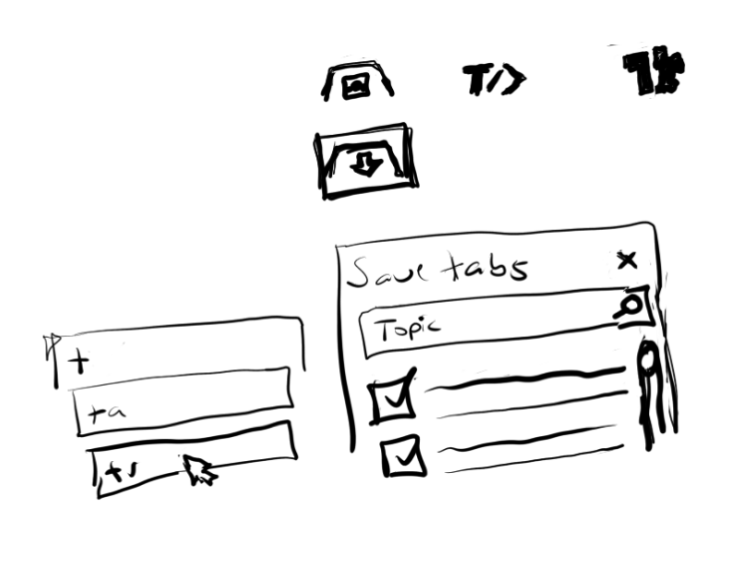

https://developer.chrome.com/extensions/getstarted

#### 02/17/2020
Following along, not sure yet the purpose of this background script yet for my extension. Onto UI ehh... brain dead

#### 02/16/2020
This is the basic interface so far.

Ehh... probably pointless to try now, so brain dead. I've built at least one extension in the past, full graphics and everything but I think I remember having problems understanding how everything synced together.

Stopped at this line: The extension is now aware that it includes a non-persistent...